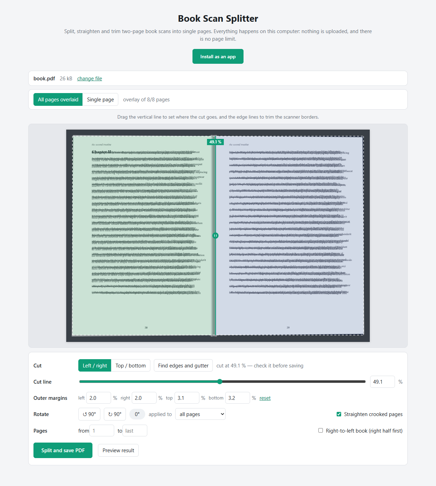

# Book Scan Splitter

Split two-page book scans into single pages — in your browser, with nothing uploaded
and no page limit.

Book scanners produce one image per *spread*: two pages side by side on a single sheet.
Online tools that cut them apart usually stop at 50 or 100 pages and want your book
uploaded to somebody's server first. Book Scan Splitter does the same job on your own
machine, on a 900-page scan if you like.

**→ [Open Book Scan Splitter](https://it-stoic.github.io/book-scan-splitter/)**



## Use it

1. Open the link above.
2. Drop your PDF on the page.
3. Position the cut line over the book's gutter.
4. Press **Split and save PDF**.

A 100-page scan comes back as a 200-page PDF, one book page per PDF page, in the right
order. Nothing to install, nothing to configure.

### Keep it as an app

In Chrome or Edge the page offers an **Install as an app** button. Press it and Book
Scan Splitter gets a desktop icon and a Start-menu entry, opens in its own window
without an address bar, and **works with no internet connection at all** — the whole
app is stored on your machine on first use. Uninstalling is a normal app uninstall. No
administrator rights are needed, so it also works on locked-down office machines.

### Is my book uploaded anywhere?

No. The page is downloaded to your browser and does the work there; your PDF is opened
from your disk, cut, and saved back to your disk. It never travels to a server — there
is no server. You can check this yourself: disconnect from the internet, then split a
book. It still works.

## Controls

**All pages overlaid** — up to 16 pages sampled across the book are drawn on top of each
other with a `darken` blend, so every pixel shows the darkest value any page has there.
You see the text block and gutter of the whole book at once, which makes it obvious
where a cut line is safe for *all* pages rather than just the one you happen to be
looking at. **Single page** steps through pages one at a time.

**Cut line** — drag the green line, use the slider, type an exact percentage, or nudge it
with <kbd>←</kbd>/<kbd>→</kbd> (hold <kbd>Shift</kbd> for larger steps).

**Outer margins** — drag the four dashed edges inwards to trim the black borders a
scanner leaves around the sheet. The area being discarded is greyed out.

**Keep whole** — page numbers that must not be cut, e.g. `1, 2, 45-47` for covers,
plates or fold-outs. Those pages are still trimmed by the outer margins, just not split
in half.

## How it works

The interesting part is what Book Scan Splitter *doesn't* do: it never re-renders your
scan.

Every output page is a PDF page dictionary pointing at the **same** `/Contents` and
`/Resources` as the original spread, with its own `/MediaBox` and `/CropBox` covering
one half of it. The two halves of a spread reference one shared copy of the scanned
image. Consequences:

- **No quality loss.** Nothing is rasterised, recompressed or re-encoded — the bytes of
  your scan are the bytes in the output.
- **No size explosion.** The image data is stored once and referenced twice, so the
  output file stays roughly the size of the input instead of doubling.
- **Fast.** A few hundred pages take about a second; the slow part is writing the file.

`/Rotate` is honoured, so the cut line follows what you see on screen rather than the
raw box coordinates — scanners frequently store a rotated page rather than rotated
pixels, and cutting on the wrong axis is the classic way to get this wrong.

Rendering the preview is [pdf.js](https://github.com/mozilla/pdf.js); writing the output
is [pdf-lib](https://github.com/Hopding/pdf-lib). Both are vendored into `vendor/`, so
the page loads nothing from any third party.

## Without a web server

The app is plain static files and also runs straight off a disk or USB stick: download
the repository and open `index.html` in a browser. Copy the whole set, keeping the
layout — the paths between them are relative:

```
index.html
app.js
style.css
split-core.js
vendor/            pdf.min.js, pdf.worker.min.js, pdf-lib.min.js
```

Opened this way, pdf.js cannot start a web worker and renders the preview on the main
thread (it logs *"Setting up fake worker"* — expected, not an error), so previews of
very large scans appear page by page. Splitting is unaffected. The app-install button
and the offline cache only exist on the hosted version.

## Limits

- The file is held in memory, so extremely large scans (well past ~1 GB) can exhaust the
  browser tab.
- Password-protected PDFs are not supported.
- One cut line applies to the whole document. Pages that need a different one can be
  listed under **Keep whole** and handled in a second pass.

Tested in Chrome. Edge shares the same engine; Firefox and Safari use nothing exotic
here but have not been verified. The install button is a Chrome/Edge feature — in other
browsers the page simply works as a page.

## Development

```sh
pnpm install
pnpm test      # geometry, all four /Rotate angles, margins, page lists, output size
pnpm vendor    # refresh vendor/ from node_modules
```

`split-core.js` holds the splitting logic and is shared verbatim by the page and the
test suite; `app.js` is only the interface. There is no build step — the page loads
plain scripts, which is also why the vendored libraries are the UMD builds rather than
ES modules (`file://` pages cannot load ES modules).

**Deployment** is GitHub Pages, driven by [.github/workflows/pages.yml](.github/workflows/pages.yml):
every push to `main` uploads the repository as it stands and deploys it. The workflow
declares `pages: write` and `id-token: write` explicitly, so it does not depend on the
repository default for `GITHUB_TOKEN`.

**After changing any app file, bump `CACHE` in `sw.js`** (`book-scan-splitter-v1` →
`book-scan-splitter-v2`). Installed copies serve the cached version until the cache name
changes, so skipping this means users keep running the old build.

## License

MIT, see [LICENSE](LICENSE).

## Credits

- [pdf.js](https://github.com/mozilla/pdf.js) — Apache-2.0
- [pdf-lib](https://github.com/Hopding/pdf-lib) — MIT
